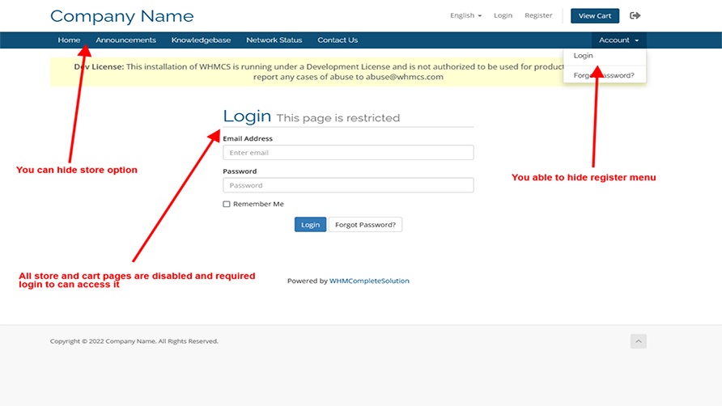

# Private Shop WHMCS
**Private Shop** module allows you to make WHMCS private store and accessible just after client login..

**Features**

- Disable Guest Clients Ordering
- Disable New Client Registrations
- Working with WHMCS 7.x and 8.x
- Without any template changes
- Working with any WHMCS templates

## Install

Download addon latest version form [latest release](https://github.com/farzadkhaledi/privateshop/releases/latest) and extract files, then upload **privateshop** folder to YOUR_WHMCS_ROOT/modules/addons folder.

Then login to your WHMCS admin area and in System Settings -> Addons Modules active **Private Shop** addon.

## Folders

<pre>
privateshop/
├── privateshop.php
├── hooks.php
├── index.php
├── whmcs.json
├── logo.png
├── lang/
    ├── index.php
    └── english.php
</pre>

## License

All contents are licensed under the [MIT license].

[mit license]: LICENSE
